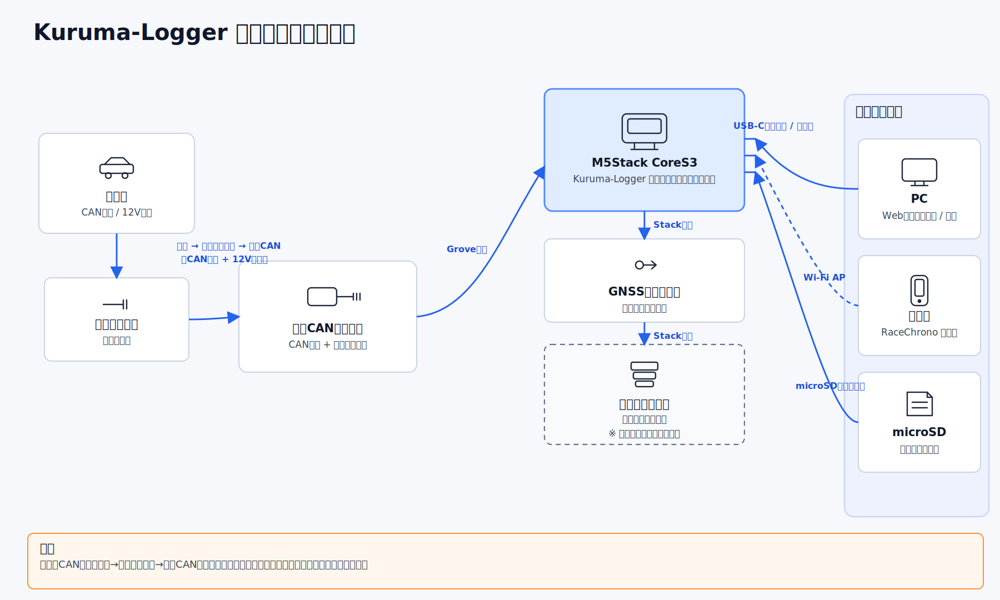
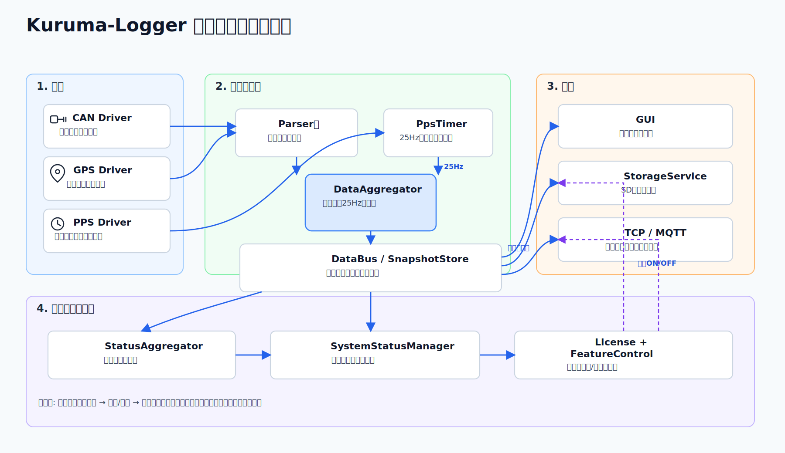

## Kuruma-Logger の機能概要

- 対応車種の CAN データを収集し、SD カードへ走行ログとして保存します。
- セットアップ手順、トラブル対応、更新情報をサポートサイトで一元管理します。
- ライセンス管理により、機能提供とアップデート配布を継続的に運用します。

::: warning 注意
Kuruma-Logger はソフトウェアとして提供されます。車両本体、配線、電源、センサー、記録媒体などのハードウェアに起因する不具合や損害については、運営者は責任を負いません。
:::

## 構成図

  <article class="home-diagram-card">
    <h3>ハードウェア構成図</h3>
    
  </article>
  <article class="home-diagram-card">
    <h3>ソフトウェア構成図</h3>
    
  </article>

