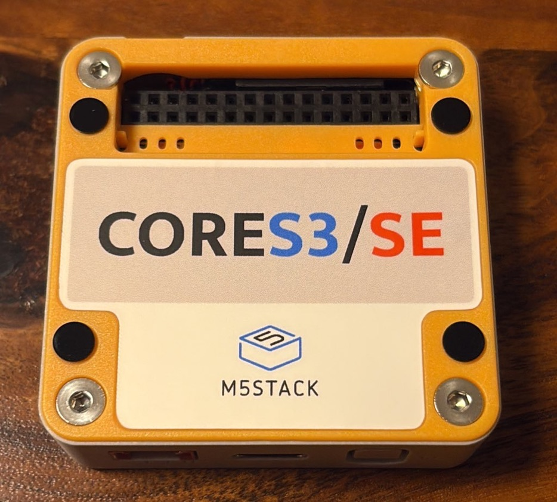
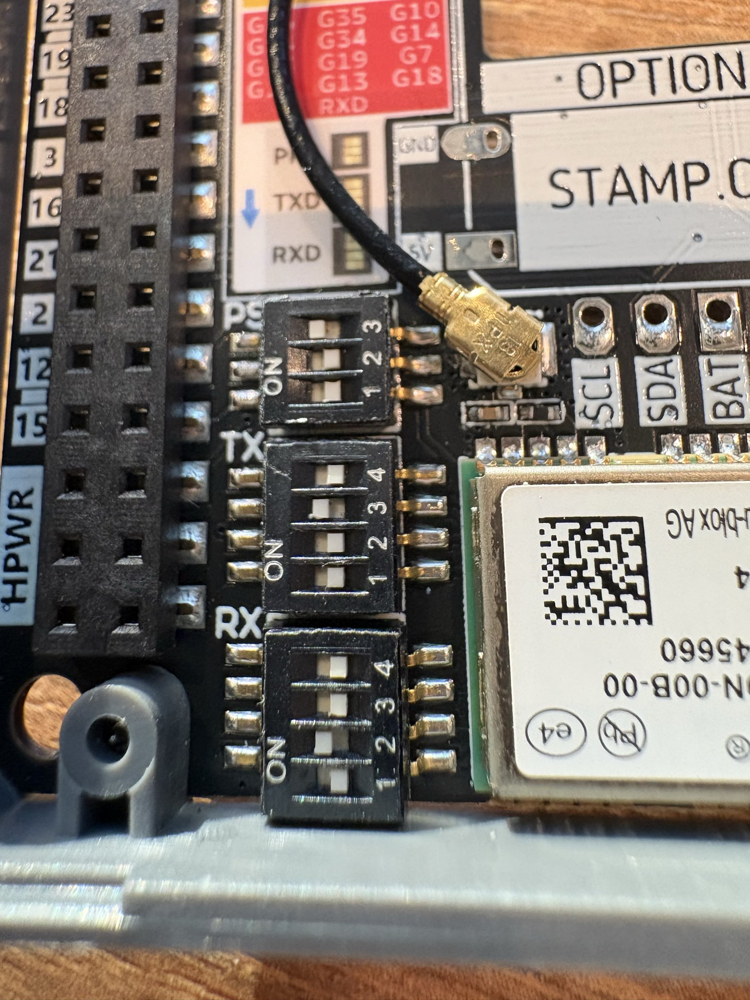
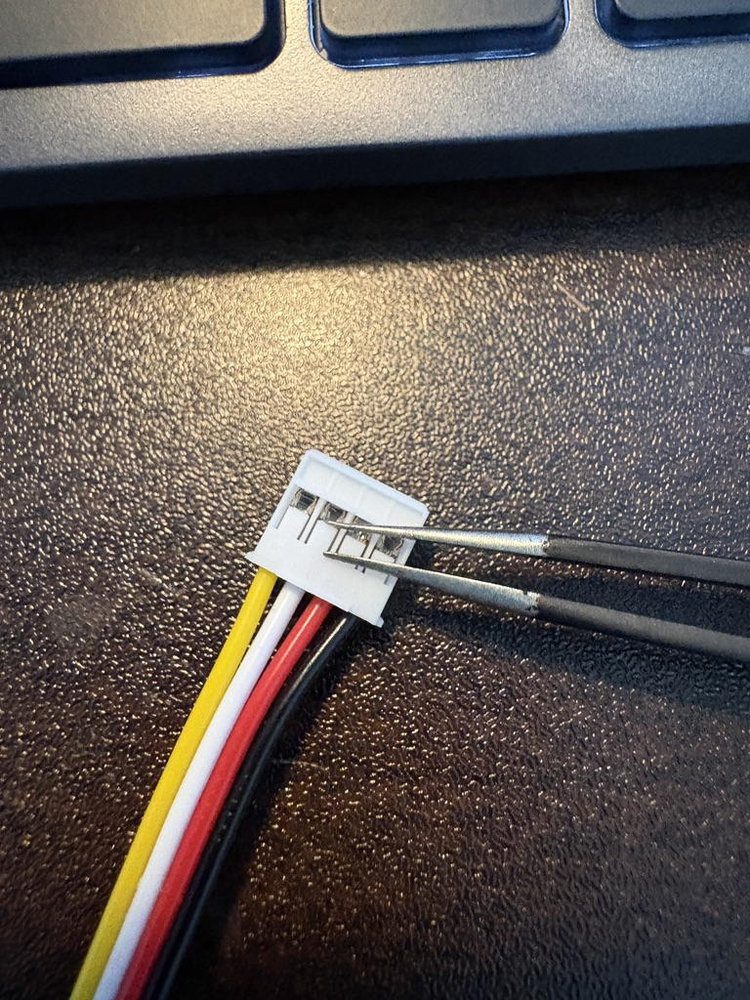
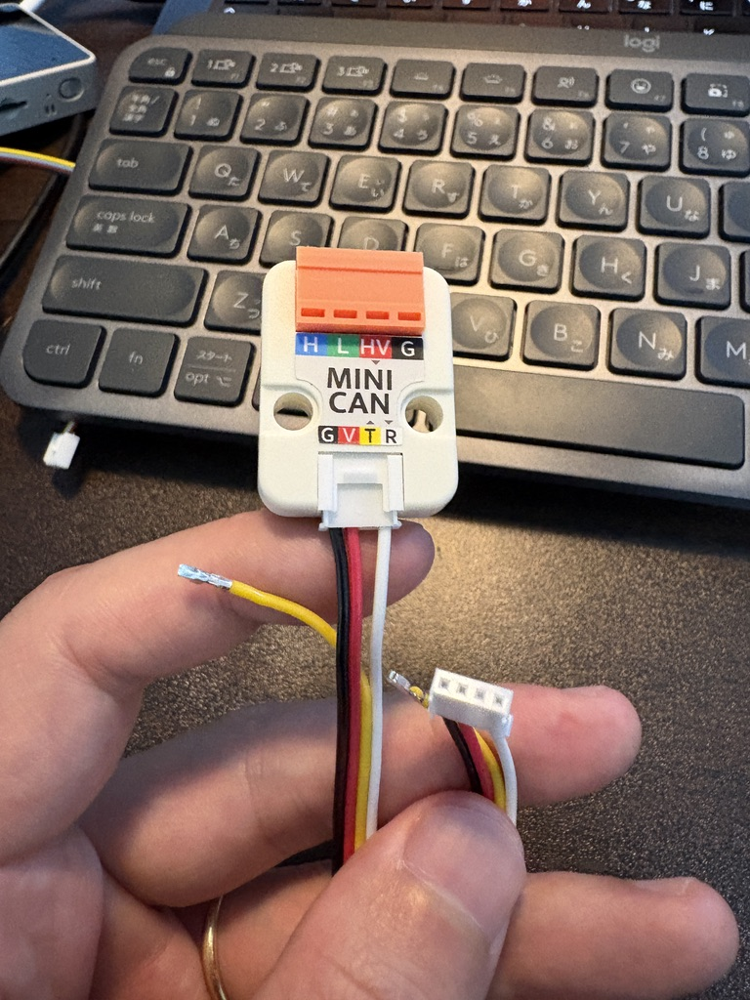
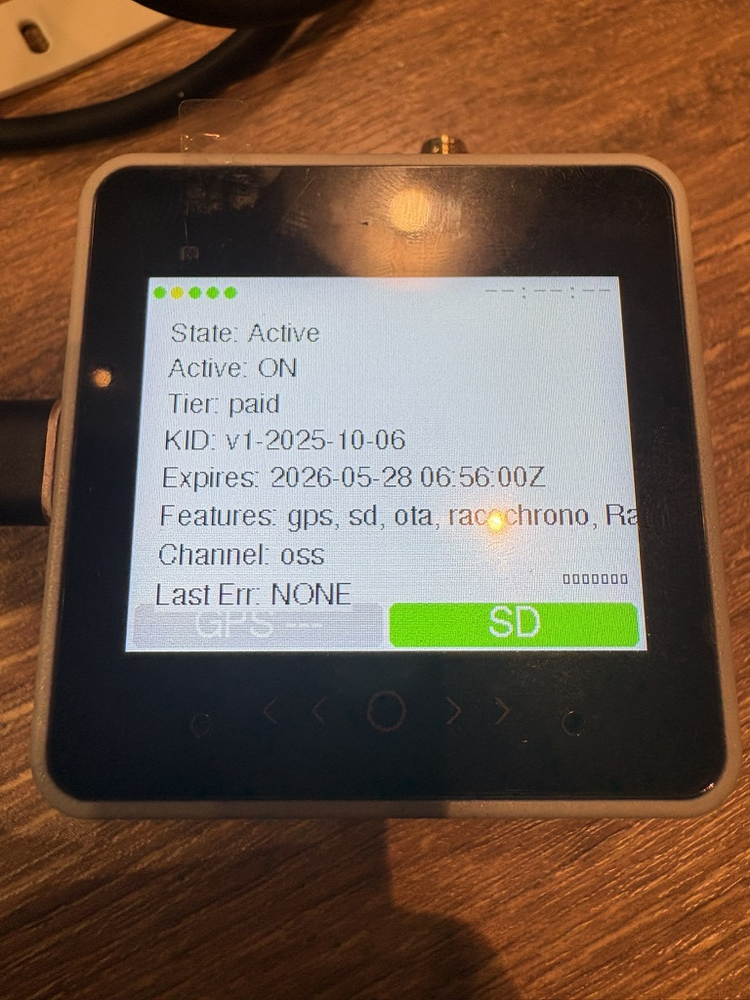
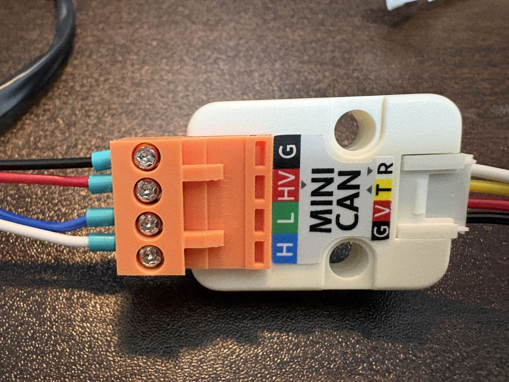
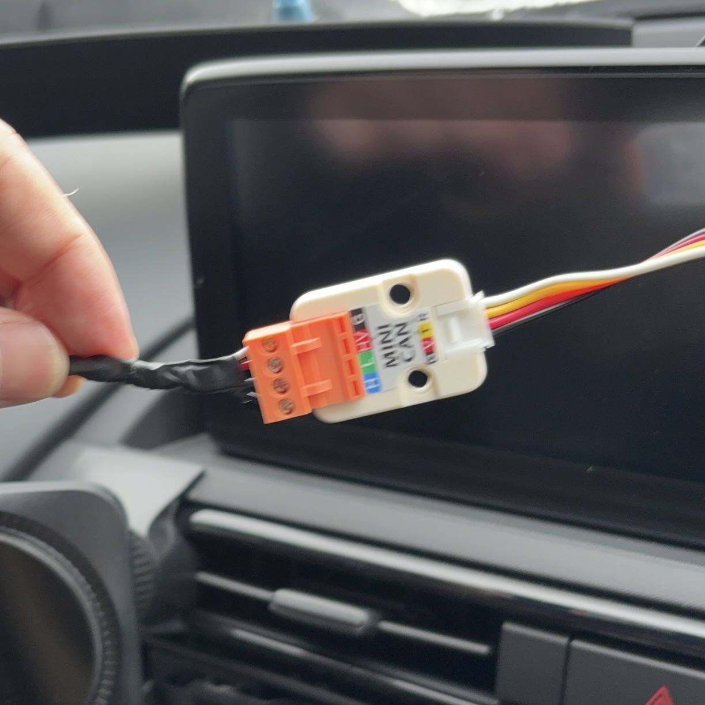
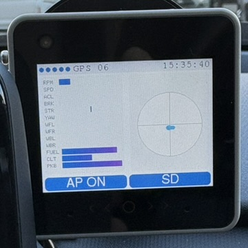

# セットアップガイド

初回導入時に必要な機材と基本手順をまとめています。

## 必要なもの

- Kuruma-Logger 対応ハードウェア
  - [M5Stack CoreS3 SE][1]
  - [M5Stack 用 GNSS モジュール 気圧/IMU/地磁気センサ付き][2]
  - [M5Stack 用ミニ CAN ユニット（TJA1051T/3）][4]
  - [microSD カード][6]
    - 32GB 以下のものを用意してください。
  - 中間ハーネス
    - [ND5RC 用][5]
    - [FL5 用][11]

- 2026/4/11追記:必要ハードウェアから[M5Stack バッテリーボトム 黒（110mAh ）V1.1][3]を削除。Lipoバッテリーの車載は発火事故の危険性があるため非推奨。

[1]: https://ssci.to/9690
[2]: https://ssci.to/9276
[3]: https://ssci.to/9572
[4]: https://ssci.to/9567
[5]: https://ssci.to/11030
[6]: https://www.amazon.co.jp/KIOXIA-%E3%82%AD%E3%82%AA%E3%82%AF%E3%82%B7%E3%82%A2-microSDHC%E3%82%AB%E3%83%BC%E3%83%89-Amazon-co-jp%E3%83%A2%E3%83%87%E3%83%AB-KLMEA032G/dp/B08PTNWQ6P?ref_=ast_sto_dp&th=1
[11]: https://minkara.carview.co.jp/userid/1653459/car/3573283/8546317/note.aspx

## ハードウェアの組み立て

1. M5Stack CoreS3 SE の裏蓋を外します。
   - 付属の六角レンチでボルト 4 本を緩め、オレンジの蓋を外します。
   - 
2. M5Stack 用 GNSS モジュールの DIP スイッチを切り替えます。
   - 画像のように下記 3 つのスイッチを ON にしてください。
   - `PS:3` を ON にします。
   - `TX:3` を ON にします。
   - `RX:2` を ON にします。
   - 
3. M5Stack CoreS3 SE と M5Stack 用 GNSS モジュール を結合します。
   - ピンが合うように固定してください。
4. Groveコネクタ（ミニCANユニットとM5Stackを繋ぐケーブル）を加工します。
   - ミニCAN￥ユニットのTXDの配線は不要であり、意図せぬ車両故障の原因にもなるため取り外します。
   - ピンセットでGroveコネクタの爪を手前に倒します。
   - 
   - 両側引き抜いて不要な配線は綺麗にとって切除しましょう。
4. M5Stack 用ミニ CAN ユニットを接続します。
   - Grove コネクタでミニ CAN ユニットと CoreS3 SE を接続します。
   - TXDに繋がる配線がコネクタから抜けていることを確認してください。
   - 

## ソフトウェアのインストール

PC と USB Type-C ケーブルを用意してください。

- PC / USB Type-C / M5Stack CoreS3 SE を接続します。
- [WEB インストーラの利用方法][7] を参考に、任意のソフトを M5Stack CoreS3 SE にインストールします。
- MAC アドレスを入力し、ライセンスを発行してください。
- ライセンスを M5Stack CoreS3 SE に送信してください。
- 上記 note にあるように、M5Stack CoreS3 SE でライセンスが認証されていることを確認してください。

ソフトウェアをアップデートする際も同じように実行してください。ライセンスは期間内であれば新規発行は不要です。最初に発行したものを利用してください。

[7]: https://note.com/kurumariond/n/n119b0978c485

## 中間ハーネスの取り付け

### ロードスター（ND5RC）の場合

エンジン OFF で作業してください。

[中間ハーネスの取り付け方法][8] に沿って取り付けます。

ミニ CAN ユニット付属のコネクタと中間ハーネスを接続します。

::: warning 注意
最悪の場合、車両が壊れる可能性があります。慎重に作業してください。スイッチサイエンスで中間ハーネスを購入した場合は、写真と同様に配線の色と `H / L / HV / G` が対応するようにミニ CAN ユニットへ接続してください。
:::

コネクタをミニ CAN ユニットに接続してください。

[8]: https://note.com/kurumariond/n/nbe64c41a821f

### シビックタイプ R（FL5）の場合

工事中です。

## 初回起動までの手順

ハードウェア配線を確認してください。

- 中間ハーネスとミニ CAN ユニットの接続を間違えないように、もう一度確認してください。

エンジンを始動します。

- M5Stack CoreS3 SE の画面の棒グラフが動いていることを確認してください。

GPS の測位には時間がかかります。

- 画面上部の `GPS` という文字の横の数字は衛星数です。調子のいい時は 17 まで上がります。

画面上部の丸アイコン 5 つがすべて青色になれば正常です。

## 画面操作方法

### microSD カードへのログ機能

#### 右下青色 `SD` ボタン

少し長押しすると赤色に変化します。

赤色になったら SD カードへのログが開始されています。

もう一度 `SD` を押すとログが終了します。

- 黄色で `wait...` と表示中はファイル変換中なので、電源を落とさないでください。

しばらくすると青色 `SD` ボタンに戻ります。これで SD ログ終了です。

<video controls src="./sd-log.mp4" title="SD ログ動画"></video>

### RaceChrono への転送機能

あらかじめスマホと RaceChrono 側の設定が必要です。設定方法は下記リンクから note を参照してください。

- [RaceChrono の設定][9]
- [RaceChrono のゲージの作り方][10]
- [Wi-Fi の設定][12]

[9]: https://note.com/kurumariond/n/n19dfccc9dd96
[10]: https://note.com/kurumariond/n/nadaeebfe7813
[12]: https://note.com/kurumariond/n/neaa7e26eae6a

#### 画面左下の灰色 `AP` ボタン

- 青色 `AP` になっていれば Wi-Fi が起動しています。
- Wi-Fi を切りたい場合は、青色 `AP` ボタンを押してください。
- 灰色になれば Wi-Fi は OFF です。

<video controls src="./ap-mode.mp4" title="AP モード動画"></video>

スマホの Wi-Fi 設定画面で、Kuruma-Logger のアクセスポイントに接続します。

- 接続するとスマホはインターネットに繋がらなくなることに注意してください。

RaceChrono のアプリを起動します。

- `開始` を押せば RaceChrono への転送が始まります。
- データが受信できない場合は設定を確認してください。

### その他

他にも機能はあるので、順次更新していきます。

問題が解消しない場合は、[トラブル対応（FAQ 統合）](../troubleshooting/) を確認してください。
