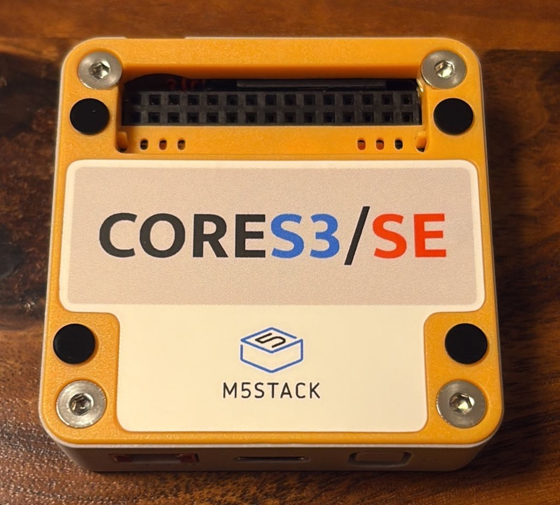
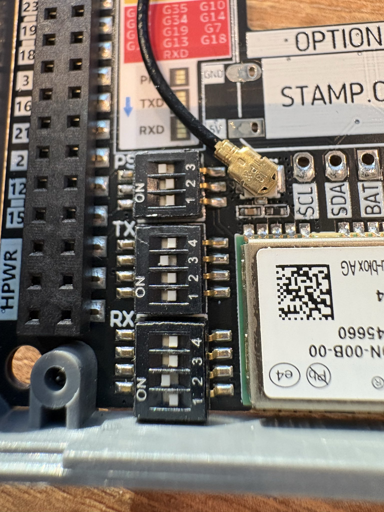
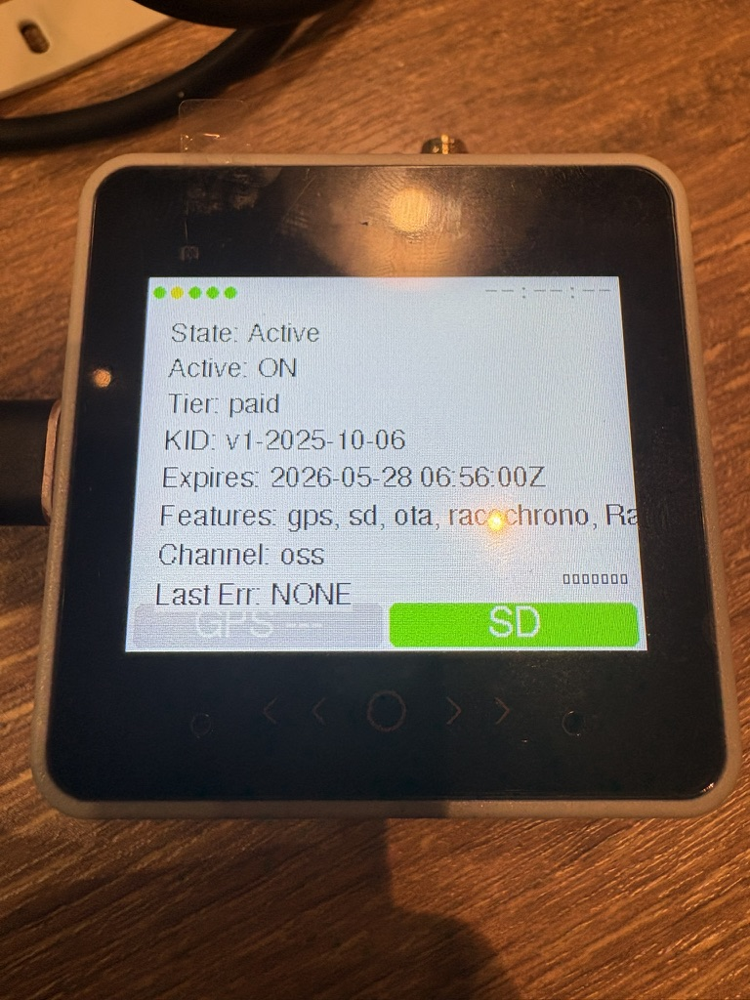
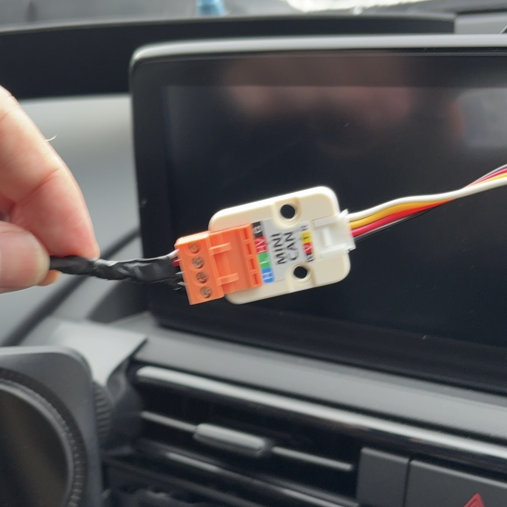
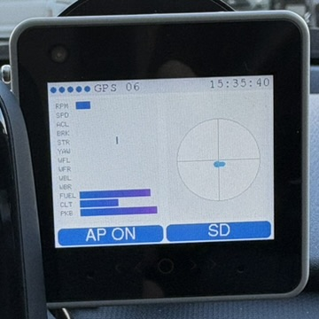

# セットアップガイド

初回導入時に必要な機材と基本手順をまとめています。

## 必要なもの

- Kuruma-Logger 対応ハードウェア
    - [M5Stack CoreS3 SE][1]

    - [M5Stack用GNSSモジュール 気圧/IMU/地磁気センサ付き][2]
    
    - [M5Stack バッテリーボトム 黒（110mAh ）V1.1][3]
    
    - [M5Stack用ミニCANユニット（TJA1051T/3）][4]
    
    - [microSDカード][6]
    
            32GB以下のものをご用意ください。
    
    - 中間ハーネス
        - [ND5RC用][5]
        - FL5用(未公開)
    
[1]:https://ssci.to/9690
[2]:https://ssci.to/9276
[3]:https://ssci.to/9572
[4]:https://ssci.to/9567
[5]:https://note.com/kurumariond/n/ne24bdf3824da
[6]:https://www.amazon.co.jp/KIOXIA-%E3%82%AD%E3%82%AA%E3%82%AF%E3%82%B7%E3%82%A2-microSDHC%E3%82%AB%E3%83%BC%E3%83%89-Amazon-co-jp%E3%83%A2%E3%83%87%E3%83%AB-KLMEA032G/dp/B08PTNWQ6P?ref_=ast_sto_dp&th=1

## ハードウェアの組み立て

1. M5Stack CoreS3 SE の裏蓋を外します。
    
        付属の６角レンチでボルト4つ緩め、オレンジの蓋を外します。
    

2. M5Stack用GNSSモジュール のDIPスイッチを切り替えます。
    
        画像のように下記3つのスイッチをONにしてください。
        PS:3をONにします。
        TX:3をONにします。
        RX:2をONにします。
    
    

3. M5Stack CoreS3 SE と M5Stack用GNSSモジュール とM5Stack バッテリーボトム　を結合します。
    
        ピンが合うようにすれば固定されます。

4. M5Stack用ミニCANユニット を接続します。

        GroveコネクタでミニCANユニットとCoreS3 SE を接続します。

## ソフトウェアのインストール
PCとUSBType-Cケーブルをご用意ください。

    PC / USBType-C / M5Stack CoreS3 SE を繋げます。

[WEBインストーラの利用方法][7]を参考にして、任意のソフトをM5Stack CoreS3 SEにインストールします。

    MACアドレスを入力し、ライセンスを発行してしください。

    ライセンスを M5Stack CoreS3 SE に送信してください。

    上記noteにあるように、M5Stack CoreS3 SE でライセンスが認証されていることを確かめてください。

ソフトウェアをアップデートする際も同じように実行してください。ライセンスは期間内であれば新規発行は不要です。最初に発行したものをご利用ください。

[7]:https://note.com/kurumariond/n/n119b0978c485

## 中間ハーネスの取り付け

### ロードスター（ND5RC）の場合

エンジンOFFで作業してください。

[中間ハーネスの取り付け方法][8]に沿って取り付けます。

ミニCANユニット付属のコネクタと中間ハーネスを接続します。続位置を間違えないようにしてください。

    最悪の場合、車両が壊る可能性があります。

コネクタをミニCANユニットに接続してください。

[8]:https://note.com/kurumariond/n/nbe64c41a821f

### シビックタイプR（FL5）の場合

    工事中

## 初回起動までの手順

ハードウェア配線を確認してください。

    中間ハーネスとミニCANユニットの接続を間違えないようにもう一度確認してください。

エンジンを始動します。

    M5Stack CoreS3 SEの画面の棒グラフが動いていることを確認してください。

GPSの測位には時間がかかります。

    画面上部のGPSという文字の横の数字は衛生数です。 調子のいい時は17まで上がります。

画面上部の⚪︎のアイコン5つが全て青色になれば正常です。

## 画面操作方法

### microSDカードへのログ機能
#### 右下青色”SD”のボタン
    
少し長押しすると赤色に変化します。

赤色になったらSDカードへのログが開始されています。
    
もう一度"SD"を押すとログが終了します。

    黄色で”wait...”と表示中はファイル変換中なので、電源を落とさないでください。

しばらくすると青色”SD”ボタンに戻ります。

これでSDログが終了です。

<video controls src="sd-log.mp4" title="Title"></video>

### RaceChronoへの転送機能
あらかじめスマホとRaceChrono側の設定が必要です。設定方法は下記リンクからnoteをご参照ください。

[RaceChronoの設定][9]

[RaceChronoのゲージの作り方][10]

[Wi-Fiの設定][11]

[9]:https://note.com/kurumariond/n/n19dfccc9dd96
[10]:https://note.com/kurumariond/n/nadaeebfe7813
[11]:https://note.com/kurumariond/n/neaa7e26eae6a

#### 画面左下の灰色”AP”ボタン

    青色”AP”になっていれば、Wi-Fiが起動しています。    
    Wi-Fiを切りたい場合は、青色”AP”ボタンを押してください。
    灰色になれば、Wi-FiがOFFです。

<video controls src="ap-mode.mp4" title="Title"></video>

スマホのWi-Fi設定画面で、Kuruma-Loggerのアクセスポイントに接続します。

    接続するとスマホはインターネットに繋がらなくなることにご注意ください。

RaceChronoのアプリを起動します。

    "開始"を押せばRaceChronoへの転送が始まります。
    データが受信できない場合は設定をご確認ください。

### その他
他にも色々機能はありますので、適宜更新していきます。

問題が解消しない場合は、[トラブル対応（FAQ統合）](../troubleshooting/)を確認してください。
